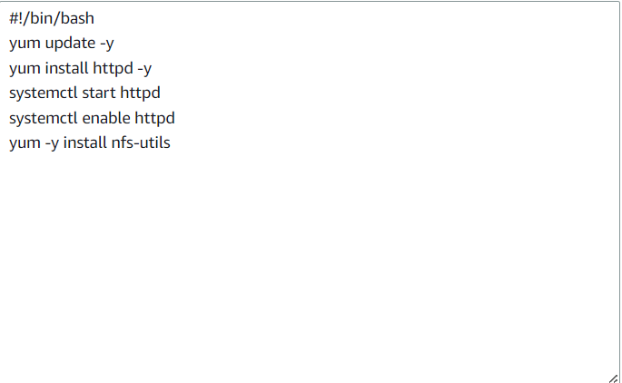
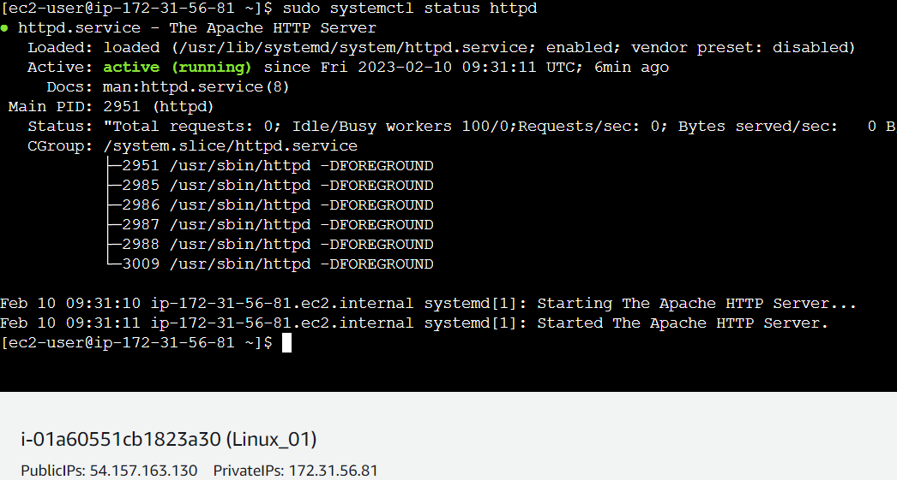
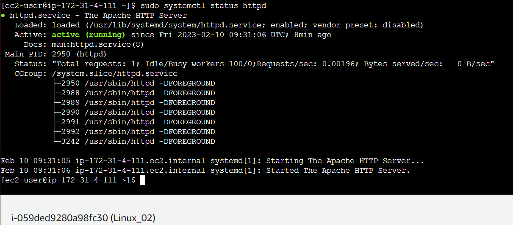
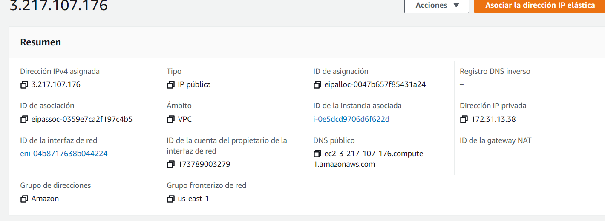
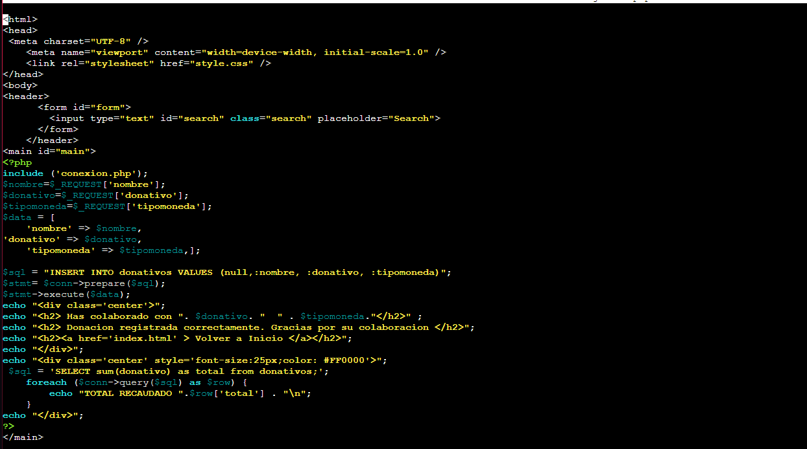
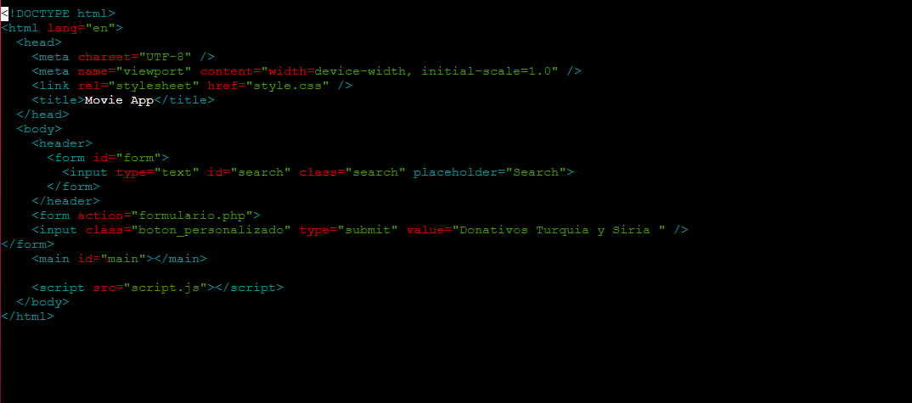
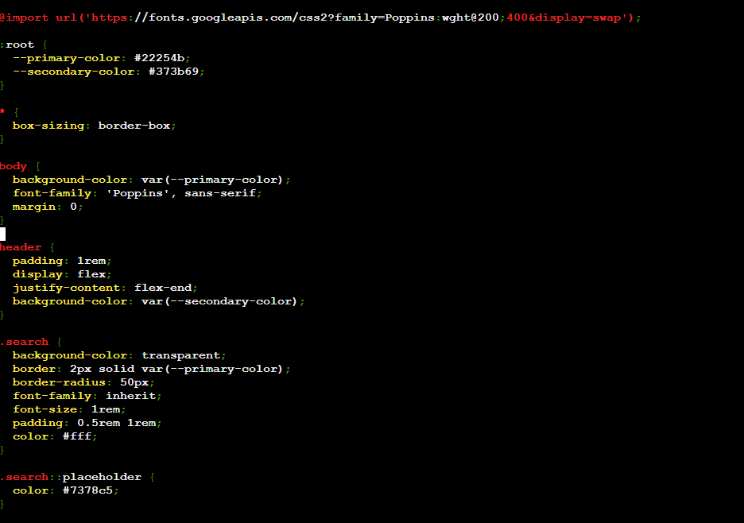
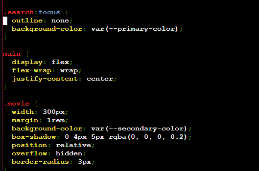
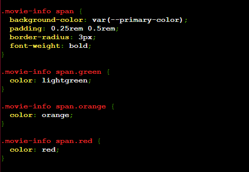
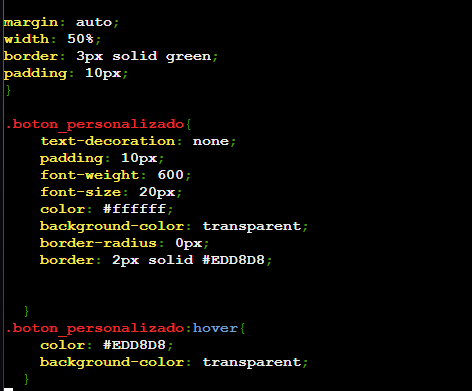

## Práctica 4.4 (semana del 23 al 27 Enero) deployment of an architecture EFS-EC2-MultiAZ in the CLoud (AWS)

1º Encendemos el laboratorio de Amazon y nos vamos a EC2.
- Nos vamos a la pestaña Security Groups y creamos un grupo nuevo al que llamaremos SGweb
    
Aqui pondremos tanto la regla del puerto http como la del SSH para que podamos acceder a ella desde cualquier lugar y lo pueda ver cualquier persona que se conecte a ella.
    
Creamos el grupo de seguridad SGefs

- Configuramos el grupo EFS para que solo accedan a el los que vengan del grupo SGweb.  
- Creamos una instancia a la que llamamos   Linux_01, que tendra un amazon linux y las par de claves que utilizaremos seran el vockey y le ponemos como grupo de seguridad el grupo SGweb que creamos anteriormente. Editaremos las opciones de configuracion de red y le pondremos que coja como opción de subred la zona disponible terminada en 1a.
    
- Una vez que tengamos toda la configuracion de la ec2 nos iremos a Datos de usuario y copiaremos los siguientes comandos
  
Una vez terminada de montar y configurar la intancia le daremos a lanzar y nos comprobara si tiene algun error, de no tenerlo se nos crearia correctamente y ya podriamos trabajar con ella  
Nos iriamos a crear la instancia 2 siguiendo los mismos pasos que antes pero cambiando algunos datos de la configuración. 
    
Esta seria la configuración que tendria nuestra Linux_02. Le pondremos los mismos comandos que a Linux_01 para que nos instale los mismos programas y terminarioamos

2º Nos vamos a la pestaña EFS y crearemos nuestro sistema de archivos. Lo llamaremos minfs y le pondremos el grupo de seguridad por defecto, tambien le pondremos que nos coja todas las zonas de disponibilidad posibles.
    
Cuando lo creemos nos llevara a la pestaña donde se encuentran todos los sistemas de archivos y veremos que el nuestro ya se encuentra disponible y que lo tenemos cifrado. Lo que necesitamos de este sistemas de archivos es el id que nos proporciona amazon.

Una vez que lo tenemos ya montado, nos vamos a la configuracion de minfs y pulsaremos en la pestaña Red. Dentro de esta pestaña esperaremos a que cargue todas las ips y le daremos a administrar.  
Dentro de la administración le pondremos a las zonas 1a y 1b el grupo de seguridad SGefs. Podriamos configurar todas las ip que nos salen pero como solo tenemos dos instancias creadas es algo innecesario, en el caso de crear mas instancias tendriamos que acordarnos de venir aqui y configurar las que sean necesarias 
    

3º Ya que tenemos configuradas las ec2 y la efs, nos conectamos a las dos instancias de ec2 para empezar a trabajar con ellas.  
Lo primero que haremos sera comprobar si se nos instalo bien apache2 que al ser la maquina de amazon linux tenemos que comprobar que esta httpd bien instalado.  
Primero nos metemos en Linux_01 y ponemos el comando sudo systemctl status httpd para saber el estado del servicio
  
Ahora iremos a Linux_02 y haremos lo mismo que con Linux_01
  
Ya que tenemos la comprobación hecha nos vamos al directorio /var/www/html y creamos una carpeta a la que llamaremos efs-mount. Como nos da error de permisos usaremos el comando sudo su para crearla y evitar ese error.

Nos iremos a nuestro sistema de archivos y copiaremos el id en el siguiente comando: sudo mount -t nfs -o nfsvers=4.1,rsize=1048576,wsize=1048576,hard,timeo=600,retrans=2,noresvport fs-09d8395cbf7d9bf1c.efs.us-east-1.amazonaws.com:/ efs-mount. Y donde pone fs-... lo cambiamos por el id de nuestra maquina. 
   

Copiamos el comando dentro de la carpeta creada anteriormente y ponemos el comando df -h para ver que efectivamente se nos ha creado la carpeta y que apunta a nuestro id. Luego pondremos un wget que en nuestro caso sera de Netflix y dejaremos que nos instale todos los datos. 

Ya que hemos instalados los paquetes le damos a descomprimir el paquete instalado para poder manejar lo archivos que tenemos dentro

Repetiremos el mismo proceso en la maquina de Linux_02 sin el wget.

Cuando hayamos configurado todos los comandos de la segunda ec2, nos iremos a la ip de la primera ec2 y comprobaremos que poniendo las ip de ambas maquinas accedemos a la página de Netflix.

4º Una vez terminada toda la configuración de las instancias linux nos iremos a crear una ec2 con el nombre de balanceador, en la cual trabajaremos para que todo lo que hemos visto en las otras instancias nos la muestre esta. Lo primero que debemos hacer antes de ponernos con la configuración del balanceador es asignarle ips elasticas a nuestras instancias linux.

Aqui abajo podemos ver una ip elastica ya asociada a una instancia Linux

Como tambien tendremos que consultar varias veces en momentos no consecutivos la ip del balanceador, le asignaremos a este támbien una ip elastica para que no tengamos que estar mirando su ip cada vez que queramos hacer una comprobacion o un reinicio.  

Ya que tenemos las ips asignadas nos iremos al balanceador. Haremos un update para actualizar el sistema e instalaremos apache2. Cuando este terminada la instalacion miraremos el estado de apache para ver si esta activado.
Ya que hemos comprobado que apache funciona lo que haremos sera instalar los comandos de a2enmon iremos uno por uno para ver si nos da algun error, en principio no deberia ya que tenemos la instalación hecha correctamente. 

Cada vez que metemos algun comando nos pone que esta instalado o que esta activo y lo unico que debemos hacer es reiniciar apache2 para que se activen.
Luego nos iremos al directorio /etc/apache2/sites-enabled para editar el archivo 000-default.conf que esta dentro de esta carpeta.
En este archivo nos iremos a la parte final y en la penultima linea del documento pondemos las etiquetas necesarias para que cuando pongamos la ip del balanceador nos salga la informacion del index que tenemos en las instalacias linux creadas y configuradas anteriormente 

Guardaremos los cambios realizados en el archivo y reiniciaremos apache para que se efectuen los cambios realizados.
En una pestaña nueva del navedador pondremos la ip del balanceador para ver si nos funciona y comprobaremos si cuando ponemos /balancer-manager para ver si podemos controlar como se visualiza la información que tenemos dentro del index situados en las otras instancias.

Ahora pondremos la ip con /balancer-manager para ver si esta funciona correctamente como el index.

Creamos una base de datos a la que conectarnos la base de datos debe de tener el puerto 3306 abierto para poder conectarnos a esta, tras crearla mientra se lanza, creamos una ec2 de windows y cambiamos el grupo de seguridad SGweb para poder conectarnos a la ec2windows como un escritorio en la nube, para esto necesitamos descargarnos la clave en la pestaña de Details del laboratirio, entramos, nos descargamos el heidisql y con el dns de la base de datos, el usuario y la contraseña nos conectamos a la base de datos y pondremos un código parecido a el siguiente

`
CREATE DATABASE Cluster;
USE Cluster;

CREATE TABLE donativos(
id INT(5) PRIMARY KEY AUTO_INCREMENT,
nombre VARCHAR(30) NOT NULL,
donativo DECIMAL (8,2) NOT NULL,
tipomoneda CHAR(5) CHECK (tipomoneda IN ('Euro','Dolar'))
);
SELECT * FROM donativos;
`

En la máquina linux dento de la carpeta efs-mount crearemos los siguientes archivos: index.html, conexion.php, grabar.php y style.css

con su respectivo código que hemos visto en clase
### Grabar.php

### Conexion.php

### Index.html

### Style.css

### Formulario.php

Tras asegurarnos de que nuestro formulario funciona y se conecta a la base de datos debemos securizar modificando en el grupo SWeb para quitarle el SSH y que no se pueda a acceder a nuestra máquina

